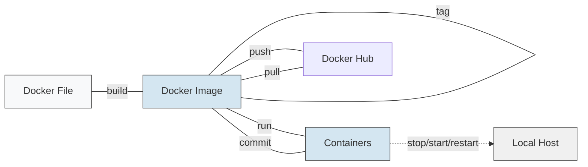

# AngularConsoleDemo

This project was generated with [Angular CLI](https://github.com/angular/angular-cli) version 14.2.3.

---

# Running Angular inside Docker

This project can be run inside Docker using Docker Desktop on Windows.

The idea is that Angular will not run directly on your Windows machine. Instead, Docker will create a small isolated environment called a **container**, and Angular will run inside that container.

---

## Basic Docker structure on Windows

On Windows, Docker usually works like this:

```text
Windows
 ├─ PowerShell
 ├─ Docker CLI
 └─ Docker Desktop
      └─ WSL2 Linux VM
           └─ Docker Engine
                └─ Containers
```

---

## What happens when I run a Docker command?

When I type a command in PowerShell like this:

```powershell
docker build -t my-angular-app .
```

PowerShell does not build the Docker image by itself.

PowerShell is only the place where I write the command.

The real flow is:

```text
PowerShell
   ↓
Docker CLI
   ↓
Docker Desktop / Docker Engine
   ↓
Docker Image or Docker Container
```

---

## Docker CLI vs Docker Engine

Docker has two important parts.

### 1. Docker CLI

Docker CLI is the command-line tool that I use from PowerShell.

For example:

```powershell
docker build
docker run
docker ps
docker images
```

The Docker CLI does not do the heavy work itself. It only sends the command to Docker Engine.

---

### 2. Docker Engine

Docker Engine is the real service that does the work.

It is responsible for:

- Building Docker images
- Running containers
- Stopping containers
- Managing Docker networks
- Managing Docker volumes
- Downloading base images like `node:22-alpine`

---

## Why do I need Docker Desktop?

On Windows, Docker needs a Linux environment to run most containers.

For example, this Dockerfile uses a Linux image:

```dockerfile
FROM node:22-alpine
```

`alpine` is a Linux-based image.

Docker Desktop creates and manages a small Linux environment inside Windows using WSL2.

So when I open Docker Desktop, it starts the Docker Engine inside that Linux environment.

That is why Docker Desktop must be running before I use Docker commands.

---

## Why did I get this error?

I got this error:

```text
ERROR: error during connect:
Head "http://%2F%2F.%2Fpipe%2FdockerDesktopLinuxEngine/_ping":
open //./pipe/dockerDesktopLinuxEngine:
The system cannot find the file specified.
```

This means Docker CLI was installed and available, but Docker Engine was not running.

In other words, PowerShell could find the `docker` command, but Docker CLI could not connect to Docker Desktop.

Docker CLI tried to contact Docker Engine through this Windows internal connection:

```text
//./pipe/dockerDesktopLinuxEngine
```

But because Docker Desktop was closed, this connection did not exist.

So the error means:

```text
Docker CLI is available, but Docker Engine is not running.
```

---

## Simple example

Imagine PowerShell is like a receptionist.

I say:

```text
Build this Docker image.
```

PowerShell passes the request to Docker CLI.

Docker CLI then tries to send the request to Docker Engine.

Docker Engine is like the real engineer who does the work.

If Docker Desktop is closed, Docker Engine is not available.

So Docker CLI cannot find anyone to execute the command.

That is why the command fails.

---

## What happens after Docker Desktop starts?

After I open Docker Desktop, Docker Engine starts in the background.

Then when I run:

```powershell
docker build -t my-angular-app .
```

Docker does the following steps:

1. Docker CLI sends the build command to Docker Engine.
2. Docker Engine reads the `Dockerfile`.
3. Docker Engine downloads the base image `node:22-alpine` if it is not already available.
4. Docker Engine creates a temporary build environment.
5. It copies `package.json` and `package-lock.json`.
6. It runs `npm install`.
7. It copies the rest of the Angular project files.
8. It creates a Docker image called `my-angular-app`.

---

## Dockerfile used in this project

Create a file called `Dockerfile` in the root of the Angular project:

```dockerfile
FROM node:22-alpine

WORKDIR /app

COPY package*.json ./

RUN npm install

COPY . .

EXPOSE 4200

CMD ["npm", "start", "--", "--host", "0.0.0.0"]
```

---

## Explanation of the Dockerfile

### `FROM node:22-alpine`

This tells Docker to start from a lightweight Linux image that already has Node.js installed.

Angular needs Node.js to run.

---

### `WORKDIR /app`

This creates and uses `/app` as the working directory inside the container.

All next commands will run from this folder.

---

### `COPY package*.json ./`

This copies `package.json` and `package-lock.json` into the container.

We copy these files first because Docker can cache the `npm install` step.

---

### `RUN npm install`

This installs the project dependencies inside the Docker image.

---

### `COPY . .`

This copies the rest of the Angular project into the container.

---

### `EXPOSE 4200`

This tells Docker that the container will use port `4200`.

Angular normally runs on port `4200`.

---

### `CMD ["npm", "start", "--", "--host", "0.0.0.0"]`

This is the command that runs when the container starts.

It runs Angular using:

```powershell
npm start -- --host 0.0.0.0
```

The important part is:

```text
--host 0.0.0.0
```

Without this, Angular may only listen inside the container, and the browser on Windows may not be able to access it.

---

## Build the Docker image

Make sure Docker Desktop is running.

Then open PowerShell inside the Angular project folder.

Example:

```powershell
cd "C:\Users\Ahmed Sadek\Desktop\Docker\angular-console-demo-with-docker-compose
```

Then build the image:

```powershell
docker build -t my-angular-app .
```

The `.` at the end means:

```text
Use the current folder as the build context.
```

Docker will look for the `Dockerfile` in this folder.

---

## Run the Docker container

After the image is built, run:

```powershell
docker run -p 4200:4200 my-angular-app
```

This means:

```text
Run a container from the image my-angular-app,
and map port 4200 from the container to port 4200 on Windows.
```

The port mapping works like this:

```text
Windows localhost:4200
        ↓
Container port 4200
        ↓
Angular app running inside Docker
```

Now open the browser and go to:

```text
http://localhost:4200
```

---

## Development vs Production: Two Ways to Run Angular in Docker

Let's clear up the confusion and understand the concept from scratch.

You now have two methods to run Angular inside Docker.

### Method 1: Development

This is what you were doing before:

```powershell
ng serve
```

Or inside Docker:

```dockerfile
CMD ["npm", "start", "--", "--host", "0.0.0.0"]
```

This means:

Angular is running as a development server.

It's suitable when you're writing code, making changes, saving, and seeing changes quickly.

Usually runs on:

```text
http://localhost:4200
```

This is called the development stage.

### Method 2: Production

When the project is finished and you want to deploy it on a real server, you should NOT use:

```powershell
ng serve
```

Why?

Because `ng serve` is made for development only, not for real deployment.

In production, you do something called:

```powershell
npm run build
```

Or:

```powershell
ng build
```

This command takes the Angular project and converts it to very simple files:

- HTML
- CSS  
- JavaScript

Angular ultimately becomes a set of static files.

These files come out in a folder usually called:

```text
dist/project-name
```

Then you need a simple server to display these files.

This is where Nginx comes in.

What is Nginx here?

Nginx here acts like a waiter or simple server that serves the files to the browser.

Instead of Angular running with:

```powershell
ng serve
```

You say:

Take the ready Angular files from `dist`
Put them inside Nginx
Let Nginx display them to people

---

## Production Dockerfile

This project also includes a `Dockerfile.prod` for building a production-ready container that serves the compiled Angular application using nginx.

### Understanding the Dockerfile.prod Structure

The `Dockerfile.prod` looks long, but it's divided into two parts - a multi-stage build.

#### Part 1: Build Stage

```dockerfile
FROM node:22-alpine AS build
```

This means:

Get an image with Node.js so I can build Angular.

Why Node.js?

Because Angular needs Node and npm to do the build.

```dockerfile
WORKDIR /app
```

This means:

Work inside a folder called `/app` inside the container.

```dockerfile
COPY package*.json ./
```

This means:

Copy `package.json` and `package-lock.json` into the container.

```dockerfile
RUN npm install
```

This means:

Download the project dependencies.

```dockerfile
COPY . .
```

This means:

Copy the rest of the project files.

```dockerfile
RUN npm run build
```

This is the most important line.

It means:

Build the Angular project and convert it to production files.

After this line, Angular will output files in:

```text
dist/...
```

For example:

```text
dist/angular-console-demo-with-docker-compose
```

#### Part 2: Nginx Stage

```dockerfile
FROM nginx:alpine
```

Here we start a new lightweight image with only Nginx.

Why? Because we don't need Node.js after the build is complete.

Why not?

Because production doesn't need Angular CLI, npm, or node_modules.

It just needs to display ready-made files.

```dockerfile
COPY --from=build /app/dist/angular-console-demo-with-docker-compose /usr/share/nginx/html
```

This line means:

Take the files that were built in the first stage from here:

```text
/app/dist/angular-console-demo-with-docker-compose
```

And put them in Nginx's default location:

```text
/usr/share/nginx/html
```

Anything placed in `/usr/share/nginx/html`, Nginx will display it in the browser.

```dockerfile
EXPOSE 80
```

This means:

The container will run internally on port 80.

So why `docker run -p 8080:80`?

The command:

```powershell
docker run -p 8080:80 my-angular-prod
```

Means:

8080 on your machine = 80 inside the container

So you open:

```text
http://localhost:8080
```

And inside the container it goes to Nginx on port 80.

### Building the Production Image

To build the production image:

```powershell
docker build -f Dockerfile.prod -t my-angular-prod .
```

This creates a multi-stage build that:
1. Uses Node.js to build the Angular application
2. Copies the built files to an nginx container
3. Serves the static files on port 80

### Running the Production Container

```powershell
docker run -p 80:80 my-angular-prod
```

Then open your browser to `http://localhost` (nginx serves on port 80 by default).

The production build is optimized, minified, and ready for deployment.

### Stage 3: Angular Production Build with Nginx

This is very important because Angular in production does not work with `ng serve`. Production Angular applications need to be built into static files and served by a web server like nginx.

#### Building the Production Image

```powershell
docker build -f Dockerfile.prod -t my-angular-prod .
```

#### Running the Production Container

```powershell
docker run -p 8080:80 my-angular-prod
```

#### Access Your Application

Open your browser and go to:

```text
http://localhost:8080
```

The production build serves your Angular application as static files through nginx on port 80 inside the container, mapped to port 8080 on your host machine.

---

## Using Docker Compose

Instead of manually building and running Docker containers with individual commands, you can use Docker Compose to manage multi-container applications. This project includes a `docker-compose.yml` file that defines the services needed to run your Angular application.

### The Role of docker-compose.yml

The `docker-compose.yml` file is a configuration file that defines:

- **Services**: The containers that make up your application (in this case, just the "frontend" service)
- **Build context**: Where to find the Dockerfile and source code
- **Ports**: Which ports to expose from containers to the host machine
- **Volumes**: How to mount host directories into containers for live development
- **Dependencies**: Relationships between different services

In this project, the `docker-compose.yml` defines a single service called "frontend" that:
- Builds a Docker image from the current directory (using the Dockerfile)
- Maps port 4200 from the container to port 4200 on your host machine
- Mounts your source code directory so changes are reflected immediately
- Mounts the node_modules directory to avoid conflicts between host and container

### Simply the Difference: Dockerfile vs Docker Compose

| What          | Dockerfile                          | Docker Compose                          |
|---------------|-------------------------------------|-----------------------------------------|
| What does it do? | Builds image                       | Runs container or group of containers  |
| Responsible for | Environment setup inside the image | Ports, volumes, services, environment variables |
| Used alone?   | Yes                                | Yes, but usually needs Dockerfile if there's build |
| Command       | `docker build`                     | `docker compose up`                    |
| Example       | Prepare Angular app                | Run Angular on port 4200               |

### The `docker compose up --build` Command

The command `docker compose up --build` does the following:

1. **Reads docker-compose.yml**: Parses the configuration file to understand what services to create
2. **Builds images**: Uses the Dockerfile to build the Docker image for each service (the `--build` flag forces a rebuild even if an image already exists)
3. **Creates containers**: Creates containers from the built images
4. **Starts services**: Starts all the defined services
5. **Sets up networking**: Creates a network for the services to communicate
6. **Mounts volumes**: Sets up the volume mounts for live development

**Why use `--build`?**
- Ensures you get the latest version of your code in the container
- Rebuilds the image if you've made changes to the Dockerfile or dependencies
- Useful during development when you're frequently updating the application

**What happens when you run `docker compose up --build`:**
1. Docker Compose reads `docker-compose.yml`
2. Finds the "frontend" service with `build: .`
3. Looks for a Dockerfile in the current directory
4. Builds the image using the Dockerfile
5. Creates and starts a container from that image
6. Maps port 4200 and mounts volumes as specified
7. Runs `npm start` inside the container to start the Angular dev server

This is much simpler than running separate `docker build` and `docker run` commands!

---

# Docker Command Reference Guide for Beginners

Welcome to the world of containerization. This guide is designed to bridge the gap between raw commands and professional DevOps workflows. Docker is a transformative technology that simplifies building, running, and managing applications by providing resource efficiency (sharing the host kernel), rapid execution, and process isolation.

---

## 1. Introduction to Docker Architecture

The Docker architecture follows a client-server model. Understanding how these three components interact is essential for troubleshooting and efficient orchestration:

* The Client: This is the Command Line Interface (CLI) where you input commands. The client acts as the messenger, sending your instructions to the host.
* The Host: The machine where Docker is installed. It runs a specific background process (daemon) called dockerd. The daemon receives commands from the client and manages the lifecycle of Images (read-only blueprints) and Containers (the active, running instances of those images).
* The Registry: A centralized store for images. While Docker Hub is the default registry for official images like Ubuntu or Python, it also serves as a destination for developers to share their own custom images.

---

## Docker Image and Container Lifecycle



This diagram shows the Docker image lifecycle exactly like the screenshot:

* The `Docker File` is the starting point.
* `build` creates a `Docker Image`.
* `tag` labels the image before pushing or running.
* `run` creates and starts a `Container` from the image.
* `commit` saves the current container filesystem into a new image.
* `push` sends a tagged image to Docker Hub.
* `pull` downloads a remote image from Docker Hub back to the local host.
* `stop/start/restart` are container lifecycle actions on the local host.

The exact sequence from the right-hand diagram is:

1. `Docker File` → `build` → `Docker Image`
2. `Docker Image` → `tag` → `Docker Image`
3. `Docker Image` → `run` → `Containers`
4. Make changes inside the running container.
5. `Containers` → `commit` → `Docker Image`
6. `Containers` → `stop/start/restart` → `Local Host`

1. Dockerfile: A text file that describes the image build steps.
   * Example:
     ```dockerfile
     FROM ubuntu
     RUN apt-get update
     CMD ["echo", "Hello from Docker"]
     ```
2. Build: `docker build -t [NAME] .` reads the Dockerfile and creates a new Docker image.
3. Tag: `docker tag [LOCAL_IMAGE] [USERNAME/REPO:TAG]` assigns a friendly alias to the image.
4. Run: `docker run [IMAGE]` creates a container from the image and starts it.
5. Commit: `docker commit [CONTAINER_ID] [NEW_IMAGE_NAME]` creates a fresh image from the current state of the container, including any changes you made inside it.

**Commit clarity:** `docker commit` is used after modifying a running or stopped container. It captures the container's current filesystem and stores that exact snapshot as a new image. This is useful for quick experiments, but for repeatable workflows, it is usually better to encode changes in a Dockerfile.

This lifecycle means that images are the immutable blueprints and containers are the live running instances. You can stop, start, or restart containers without changing the original image, and you can capture container changes with `docker commit` when needed.

---

## 2. Image Management Commands

Images are the "blueprints" for your containers. Docker uses a "local-first" logic: whenever you request an image, Docker checks the Host first. If it isn't found locally, it retrieves it from the Registry.

* `docker pull [IMAGE_NAME]`: Retrieves a specific image from the Registry to the Local Host.
* `docker images`: Lists all images currently stored locally, including their tags and sizes.
* `docker rmi [IMAGE_ID]`: Removes a local image. Note: To delete an image, you must first stop and remove any containers that were created from it.
* `docker history [IMAGE_NAME]`: Displays the specific layers, commands, and sizes that compose an image.

**Pro-Tip:** The Power of Layers Docker images are a stack of read-only layers. Using `docker history` allows you to see the instructions that built the image. Because these layers are shared, if multiple images use the same base layer, Docker only stores that layer once, saving massive amounts of disk space.

---

## 3. Container Lifecycle Management

There are two ways to manage a container's lifecycle: the manual sequence for granular control and the "DevOps shortcut" for speed.

### The Lifecycle Workflow

In the manual cycle, you move through create (initializing the container), start (running the application), and stop (halting the process). In production, we typically use `run`, which acts as a shortcut by pulling the image, creating the container, and starting it in one step.

| Command | Action | Context/Notes |
|---|---|---|
| `docker create [IMAGE]` | Create | Initializes a container from an image but keeps it in a "stopped" state.
| `docker start [CONTAINER_ID]` | Start | Activates a created or stopped container.
| `docker stop [CONTAINER_ID]` | Stop | Gracefully halts a running container to save RAM/CPU.
| `docker run [IMAGE]` | Run | The "DevOps Shortcut": Combines pull, create, and start.
| `docker ps` | Monitor | Lists only currently running containers.
| `docker ps -a` | Monitor All | Lists all containers, including those that are stopped/exited.
| `docker rm [CONTAINER_ID]` | Cleanup | Deletes a stopped container from the host.
| `docker rm -f [CONTAINER_ID]` | Forced Cleanup | Immediately stops and removes a running container.

**Pedagogical Insight:** Beginners often panic when a container "disappears" after a task. It likely just stopped. Use `docker ps -a` to find these "missing" containers and inspect their exit status.

---

## 4. Command Flags and Working Inside Containers

Flags modify the behavior of the `docker run` command to suit different workloads.

* `-it`: Interactive terminal mode (TTY). Essential for when you need to type commands directly into the container shell.
* `-d`: Detached mode. Runs the container in the background so your terminal remains free.
* `--name`: Assigns a custom name to a container (e.g., `--name my-web-server`) instead of a random ID.
* `--rm`: Automatic removal. This is perfect for transient workloads, such as running a one-off Python script or a temporary Ubuntu shell, as it deletes the container the moment it stops.

### Entering an Existing Container

It is critical to distinguish between `run` and `exec`. While `docker run` creates a new container, `docker exec` allows you to enter a container that is already running.

```bash
docker exec -it [CONTAINER_ID_OR_NAME] bash
```

---

## 5. Docker Networking and Port Mapping

When Docker starts, it creates a virtual bridge called `docker0`. This bridge acts as the gateway and typically takes the IP address `172.17.0.1`. Every container you launch is assigned a private IP in the `172.17.0.x` range.

To make these private services accessible from your machine (the host), you must use Port Mapping with the `-p` flag.

```bash
docker run -p [Public/Host Port]:[Private/Container Port] [IMAGE]
```

Example:

```bash
docker run -p 3000:80 nginx
```

In this example, traffic to your machine on port `3000` is forwarded to port `80` inside the Nginx container.

**Warning:** Port `80` is the default internal port for most web service containers like Nginx. Always map the Container Port (`80`) to an available Host Port (like `3000` or `8080`) to avoid conflicts.

---

## 6. Data Persistence: Volumes and Bind Mounts

Containers are ephemeral; if they are deleted, their data dies with them. Persistence ensures data survives container crashes.

* Docker Volumes (Best Practice): Managed by Docker and stored in `/var/lib/docker/volumes`. These are ideal for Database storage where Docker handles the file system.
* Bind Mounts: Connects a specific directory on your Host directly to a directory in the Container. This is ideal for Websites, as you can edit code on your host and see the changes reflected instantly in the container.

### Path Syntax Comparison

* Named Volume: `docker run -v my_database_data:/var/lib/mysql [IMAGE]` (References a name in the Docker subsystem).
* Bind Mount: `docker run -v /home/user/my-website:/var/www/html [IMAGE]` (Requires a full absolute path on the host).

---

## 7. Building and Pushing Custom Images

The developer workflow follows a specific cycle: Code -> Dockerfile -> Build -> Image -> Push.

### The Dockerfile Keywords

1. `FROM`: Sets the base image (e.g., `FROM ubuntu`).
2. `RUN`: Installs software or runs commands during the build process.
3. `CMD`: The default command that runs when the container starts. This can be overridden at runtime.
4. `EXPOSE`: Documents the ports the container intends to use.

### Developer Workflow: From Code to Hub

1. Build: `docker build -t [USERNAME/REPO:TAG] .` The "dot" (`.`) instructs Docker to look for the Dockerfile in the current working directory.
2. Login: `docker login` (Authenticate with your Docker Hub account).
3. Tag: `docker tag [LOCAL_IMAGE] [USERNAME/REPO:TAG]` (Create a versioned alias).
4. Push: `docker push [USERNAME/REPO:TAG]` (Upload to the Registry).

Note: Images in Public repositories are accessible to everyone; Private repositories are restricted to the account owner.

---

## 8. Quick Reference Command Summary

| Category | Command | Brief Purpose |
|---|---|---|
| Images | `docker pull [IMAGE]` | Download image from Registry to Host. |
| Images | `docker images` | List all locally stored images. |
| Images | `docker rmi [IMAGE_ID]` | Delete a local image. |
| Images | `docker history [IMAGE]` | View image layers and build steps. |
| Containers | `docker run [IMAGE]` | The shortcut to pull, create, and start. |
| Containers | `docker ps -a` | List all containers (find "missing" ones). |
| Containers | `docker stop [ID]` | Gracefully stop a running container. |
| Containers | `docker rm [ID]` | Delete a stopped container. |
| Containers | `docker exec -it [ID] bash` | Enter an already running container. |
| Volumes | `docker volume ls` | List all persistent volumes. |
| System | `docker login` | Authenticate with a Registry account. |
| Build | `docker build -t [NAME] .` | Create an image from the local Dockerfile. |
| Registry | `docker push [NAME]` | Upload a custom image to the Registry. |


### Summary

**Use Dockerfile when you ask:**
- "How do I build an image for the project?"

**Use Docker Compose when you ask:**
- "How do I run the project and its services?"

**In your case with Angular:**
- **Dockerfile** = prepares Angular environment
- **docker-compose.yml** = runs Angular and opens port 4200 and links project files

---

## Useful Docker commands

Show running containers:

```powershell
docker ps
```

Show all containers, including stopped ones:

```powershell
docker ps -a
```

Show Docker images:

```powershell
docker images
```

Stop a running container:

```powershell
docker stop container-name-or-id
```

Remove a container:

```powershell
docker rm container-name-or-id
```

Remove an image:

```powershell
docker rmi my-angular-app
```

---

# Angular CLI Commands

## Development server

Run:

```powershell
ng serve
```

Navigate to:

```text
http://localhost:4200/
```

The application will automatically reload if you change any source files.

---

## Code scaffolding

Run:

```powershell
ng generate component component-name
```

You can also use:

```powershell
ng generate directive
ng generate pipe
ng generate service
ng generate class
ng generate guard
ng generate interface
ng generate enum
ng generate module
```

---

## Build

Run:

```powershell
ng build
```

The build artifacts will be stored in the `dist/` directory.

---

## Running unit tests

Run:

```powershell
ng test
```

This executes the unit tests using [Karma](https://karma-runner.github.io).

---

## Running end-to-end tests

Run:

```powershell
ng e2e
```

To use this command, you need to first add a package that supports end-to-end testing.

---

## Further help

To get more help with Angular CLI, run:

```powershell
ng help
```

Or check the [Angular CLI Overview and Command Reference](https://angular.io/cli).

---

# Summary

PowerShell does not run containers directly.

PowerShell runs the `docker` command.

The `docker` command is the Docker CLI.

Docker CLI sends the request to Docker Engine.

Docker Engine is started and managed by Docker Desktop on Windows.

Docker Engine is the part that builds images and runs containers.

That is why Docker Desktop must be running before using commands like:

```powershell
docker build
docker run
docker ps
```

The full flow is:

```text
PowerShell
   ↓
Docker CLI
   ↓
Docker Desktop
   ↓
WSL2 Linux VM
   ↓
Docker Engine
   ↓
Docker Image / Container
```
